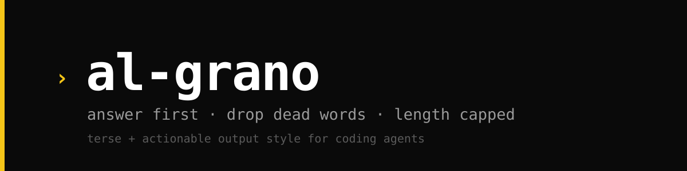

  

  <em>Get to the point. Answer first, zero filler, length capped.</em>

  <a href="README.md">🇪🇸 Español</a> · 🇬🇧 English

## What it does

An output-style skill for your coding assistant. It merges two disciplines into one:

- **Terse** (caveman lineage): drops articles, filler, pleasantries, and empty hedging. Keeps every bit of technical substance. Code, commands, and error strings stay verbatim.
- **Actionable** (ADHD-friendly, inspired by [`ayghri/i-have-adhd`](https://github.com/ayghri/i-have-adhd)): answer on line one, numbered steps, state restated across turns, no preamble, no recap, no closer.

Plus a hard budget: a task close is 10 lines or fewer, one table max, findings one line each with the detail pushed to the commit or the devlog.

It fires automatically on session start and stays on until you say `para al-grano`, `stop al-grano`, or `normal mode`.

## Before / after

**Before**
> Great question! Let me look at this. Your auth flow has a few moving pieces: the middleware, the token verification, and the cookie handling. Looking at `src/auth.ts`, the `verifyToken` function around lines 42-58 seems to use an older API. One approach would be to update the package and rewrite that function. After that you'd want to run the auth tests. By the way, your dependencies look stale overall. Hope this helps, let me know if you want to dig deeper!

**After**
> Bug in `src/auth.ts:42`. Token check uses `<`, needs `<=`.
> 1. Edit `src/auth.ts:42`, change `<` to `<=`.
> 2. Run `npm test -- auth.spec.ts`.
>
> Separately: the dependency is stale. Want me to handle that next?

## Install

See [INSTALL.md](INSTALL.md). Claude Code and Codex are supported. The skill Markdown alone works on any runtime that imports a `SKILL.md`.

## Turn it off

Say `para al-grano` or `normal mode`. Say `al grano` to turn it back on.

## License

MIT. See [LICENSE](LICENSE).
